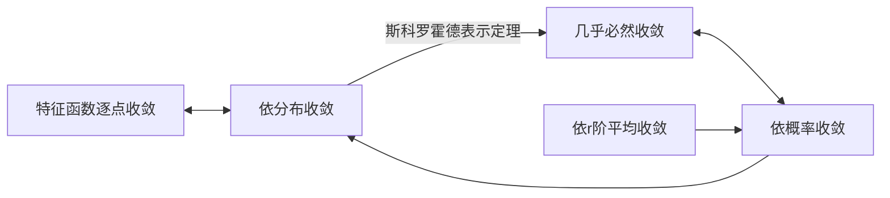

# 概率论

## 目录

太长了

## 第一章 课程导论

### 样本空间   $\Omega$

某个随机试验所有可能的结果构成的非空集合称为它的样本空间, 通常用大写希腊字母$\Omega$表示. 

### 样本点   $\omega$

样本空间中$\Omega$中的元素, 用$\omega$表示. 

### 概率   $P(A)$

某个随机事件$A\subset \Omega$的概率是介于$0$和$1$之间的一个实数$P(A)$, 它给出$A$发生的可能性大小的描述. 

### 必然事件 / 不可能事件 / 对立事件

我们称样本空间$\Omega$为*必然事件*并且规定$P(\Omega)=1$, 

而称空集$\emptyset$为*不可能事件*并且规定$P(\emptyset)=0$, 

事件的余集$A^c$也称为它的*对立事件*. 

### 贝努利 (Bernoulli) 试验

假设在一个随机试验中, 我们只关心$A\subset\Omega$是否发生, 并且易知$P(A)=p$和$P(A^c)=1-p$. 其中$0\le p\le 1$. 这样的随机试验称为贝努利试验. 在贝努利试验中事件$A$发生称为*成功*, 事件$A^c$发生称为*失败*.

### 随机事件之间的基本关系

$A\cap B=A $ 和 $B$ 同时发生; ( 为简单起见经常使用$AB=A\cap B\ $)

$A\cup B=A $ 和 $B$ /至少有一个发生;

$A\textbackslash B=A $ 和 $B$ 同时发生;

$A\in B=A $ 发生则 $B$ 发生;

### 互斥 / 互不相容

$A\cap B=\emptyset\ $

### 频率   $F_n(A)$

$F_n(A)=\frac{S_n}{n}$

$S_n$表示事件$A$在这$n$次试验中发生的次数. 

频率具有以下性质:

1) 正性: $F_n(A)\ge0$
2) 规范性: $F_n(\Omega)=1$
3) 可加性: 若$AB=\emptyset$, 则$F_n(A\cup B)=F_n(A)+F_n(B)$

###　古典概率模型

样本空间只包含有限个样本点; 各个样本点出现概率相等; 

1. 正性
2. 规范性
3. 可数可加性

### 几何概率模型

样本空间是欧氏空间的某个具有体积的子集; 子集可求体积

1. 正性
2. 规范性
3. 可数可加性

## 第二章 概率空间与概率测度

### $\sigma\ $ 代数

$\mathscr{F}$是由$\Omega$的子集构成的类. 

称$\mathscr{F}$为样本空间上的$\sigma\ $代数, 如果:

1. $\Omega\in\mathscr{F}$
2. 若$A\in\mathscr{F}$, 则$A^c\in\mathscr{F}$
3. 若$A_1, A_2,\cdots\in\mathscr{F}$, 则$\ \bigcap^{\infty}_{k=1}A_k\in\mathscr{F}/\bigcup^{\infty}_{k=1}A_k\in\mathscr{F}$

### 可测空间

集合和$\sigma$代数

### 概率密度 / 可数可加性

假设$(\Omega, \mathscr{F})$为可测空间, $P$是定义在$\mathscr{F}$上的取值于$[0,1]$的函数.

称$P$为一个 *概率* 或 *概率密度* , 如果

对于两两不交的集合列$\{A_1,A_2, \cdots\ \}\subset \mathscr{F}\ $有
$$
P\left(\bigcup^{\infty}_{n=1}A_n\right)=\sum^{\infty}_{n=1}P(A_n)
$$
此时称$(\Omega, \mathscr{F},P)$为概率空间, $\mathscr{F}$为 *事件域* . 事件域中的集合称为 *随机事件* , 简称 *事件* .

### 上下极限

*上极限*
$$
\limsup_{n\to\infty}A_n:=\bigcap_{n=1}^{\infty}\bigcup_{k=n}^{\infty}A_k
$$
*下极限*
$$
\liminf_{n\to\infty}A_n:=\bigcup_{n=1}^{\infty}\bigcap_{k=n}^{\infty}A_k
$$

### 上连续性 / 下连续性

*下连续性*

如果$\ \{A_n\}\in\ \mathscr{F}$单增, 则有
$$
P\left(\bigcup^{\infty}_{n=1}A_n\right)=\lim_{n\to\infty}
P(A_n)
$$
*上连续性*

如果$\ \{A_n\}\in\ \mathscr{F}$单降, 则有
$$
P\left(\bigcap^{\infty}_{n=1}A_n\right)=\lim_{n\to\infty}
P(A_n)
$$
### 条件概率

我们称$P(A|B)$为已知$B$发生的情况下$A$发生的概率. 
$$
P(A|B)=\frac{P(AB)}{P(B)}
$$
易知
$$
P(AB)=P(B)P(A|B)
$$
### 乘法定理

对任何$A_1,A_2,\cdots,A_n\in\mathscr{F}$有
$$
P(A_1A_2\cdots A_n)=P(A_1)P(A_|A_1)\cdots P(A_n|A_1\cdots A_{n-1})
$$
### 条件概率测度 / 条件概率空间

由$P(A|B)=\frac{P(AB)}{P(B)}$定义的集函数$P_B(\cdot |B))$也是可测空间$(\Omega,\mathscr{F})$上的概率测度. 我们称$P_B$为给定事件$B$的 *条件概率测度* , 而称$(\Omega,\mathscr{F},P_B)$为给定事件$B$的 *条件概率空间* .

### 全概率公式

如果事件列$\{B_1,B_2,\cdots\}\subset\mathscr{F}$两两不交而且满足$\bigcup_{n=1}^{\infty}=\Omega$, 我们就称之为$\Omega$的一个 *可数划分* . 则对任何$A\in{\mathscr{F}}$有
$$
P(A)=\sum^{\infty}_{n=1}P(B_n)P(A|B_n).
$$
贝叶斯公式

设$\{B_n\}$为$\Omega$的一个划分. 则对任何$\ A\in\mathscr{F}$有
$$
P(B_k|A)=\frac{P(B_k)P(A|B_k)}{P(A)}=\frac{P(B_k)P(A|B_k)}{\sum_nP(B_n)P(A|B_n)}
$$
### 集合代数

设$\mathscr{A}$是非空集合$\Omega$的子集类. 称$\mathscr{A}$为$\Omega$上的 *集合代数* , 简称 *集代数* , 如果以下性质成立:

1. $\Omega\in\mathscr{A}$
2. 如果$A\in\mathscr{A}$, 则$A^c\in\mathscr{A}$
3. 如果$A,B\in\mathscr{A}$, 则$A\cup B\in\mathscr{A}$/$A\cap B\in\mathscr{A}$

具有如下性质

1. $A_1, A_2,\cdots,A_n\in\mathscr{A}$, 则有$\bigcap^{n}_{k=1}A_k\in\mathscr{A}/\bigcup^{n}_{k=1}A_k\in\mathscr{A}$

$\mathscr{A}$是集代数$\Leftrightarrow$$\Omega\in\mathscr{A}$, 若$A,B\in\mathscr{A}$, 则有$A\textbackslash B\in\mathscr{A}$

### 最小 $\sigma$ 代数

假设$\{\mathscr{F}_{\alpha}:\alpha\in I\}$是$\Omega$上的一族$\sigma$代数, 其中$I$为指标集. 则$\mathscr{F}:=\bigcap_{\alpha\in I}\mathscr{F}_{\alpha}$也是是$\Omega$上的一族$\sigma$代数. 

给定非空集合$\Omega$上的一个子集类$\mathscr{G}$, 用$\mathscr{F}_\alpha,\alpha\in I_{\mathscr{G}}$表所有包含$\mathscr{G}$的$\sigma$代数, 其中指标集$I_{\mathscr{G}}$由$\mathscr{G}$决定. 我们令
$$
\sigma(\mathscr{G}):=\bigcap_{\alpha\in I_{\mathscr{G}}}\mathscr{F}_{\alpha}
$$
显然$\sigma(\mathscr{G})$是$\Omega$上包含$\mathscr{G}$的最小$\sigma$代数, 称为 *由$\ \mathscr{G}\ $生成的$\ \sigma\ $代数*. 

注意: 

1. 如果$\mathscr{G}$是$\sigma$代数, 则$\mathscr{G}=\sigma(\mathscr{G})$.
2. 若$\mathscr{E}\subset\mathscr{G}$. 则$\sigma(\mathscr{E})\in\sigma(\mathscr{G})$

### 单调类定理

设$\mathscr{M}$是非空集合$\Omega$的子集类. 称$\mathscr{M}$为$\Omega$上的 *单调类* 如果以下性质成立:

1. 若$\{A_k\}\subset\mathscr{M}$单调增, 则$\bigcup_{k=1}^{\infty}A_k\in\mathscr{M}$
2. 若$\{A_k\}\subset\mathscr{M}$单调降, 则$\bigcap_{k=1}^{\infty}A_k\in\mathscr{M}$

显然$\sigma$  代数是单调类. 

给定非空集合$\Omega$的一个子集类$\mathscr{G}$, 用$\mathscr{M}_{\alpha},\alpha\in J_{\mathscr{G}}$表示包含$\mathscr{G}$的所有单调类, 其中指标集$J_{\mathscr{G}}$由$\mathscr{G}$决定. 我们称
$$
m(\mathscr{G}):=\bigcap_{\alpha\in J_{\mathscr{G}}}\mathscr{M}_\alpha
$$
为 *由 $\ \mathscr{G}\ $ 生成的单调类* . 它是$\Omega$上的包含$\mathscr{G}$的最小单调类.

部分性质:

1. 假设$\{\mathscr{M}_\alpha:\alpha\in J\}$是$\Omega$上的一族单调类, 其中$J$为指标集. 则$\bigcap_{\alpha\in J}\mathscr{M}_{\alpha}$也是$\Omega$上的单调类. 
2. 特别的, 如果$\mathscr{G}$是单调类, 则$\mathscr{G}=m(\mathscr{G})$
3. 若$\mathscr{E}\subset\mathscr{G}$. 则$m(\mathscr{E})\in m(\mathscr{G})$
4. 若$\mathscr{F}$既是集代数又是单调类, 则它是$\sigma$代数
5. 设$\mathscr{A}$是集代数. 则对任何$A\subset\Omega$集类$\mathscr{M}_A$是单调类
6. 设$\mathscr{A}$是集代数. 则对$A\in\mathscr{A}$有$\mathscr{M}_A\supset m(\mathscr{A})$
7. 设$\mathscr{A}$是集代数. 则对$A\in m(\mathscr{A})$有$\mathscr{M}_A\supset m(\mathscr{A})$
8. 设$\mathscr{A}$是集代数. 则$m(\mathscr{A})$是$\sigma$代数
9. (单调类定理). 设$\mathscr{A}$是集代数. 则$m(\mathscr{A})=\sigma(\mathscr{A})$

### 博雷尔可测集

$\mathscr{O}^d$为$d$维欧氏空间$\mathbb{R}^d$所有开集构成的集类. 

$\mathscr{B}^d:=\sigma(\mathscr{O}^d)$ 为$\mathbb{R}^d$的 *博雷尔 $\sigma$ 代数*

称$\mathscr{B}^d$中的集合为 *博雷尔可测集*

称$(\mathbb{R}^d,\mathscr{B}^d)$为 *博雷尔可测空间*

一些命题和性质:

1. 令$\mathscr{U}$是$\mathbb{R}$上全体开区间构成的集类. 则$\mathscr{B}=\sigma(\mathscr{U})$

2. 令$\mathscr{S}$是所有$\mathbb{R}$上形如$(a,b]$和$(a,\infty)$的区域构成的集类, 其中$-\infty\le a\le b <\infty$.再令
$$
\mathscr{A}=\{V_1\cup\cdots\cup V_n:n\ge1且V_1,\cdots,V_n\in\mathscr{S}两两不交\}
$$
		则$\mathscr{A}$是集代数且$\mathscr{B}=\sigma(\mathscr{A})=\sigma(\mathscr{S})$

### 事件的独立性

假设$(\Omega,\mathscr{F},P)$为概率空间. 若事件$A,B\in\mathscr{F}$满足
$$
P(AB)=P(A)P(B)
$$
我们称它们是 *相互独立* 的.

下面的性质等价:

1. 事件$A$与$B$独立
2. $A$与$B^c$独立
3. $A^c$与$B$独立
4. $A^c$与$B^c$独立

概率为$0$或$1$的事件与任何事件独立

### 多个事件的独立性

假设$(\Omega,\mathscr{F},P)$为概率空间. 再设$A_1,\cdots, A_n\in\mathscr{F}(n\ge2)$. 若对任何$2\le k\le n$及任何$1\le i_1 <\cdots<i_k\le n$都有
$$
P(A_{i_1}\cdots A_{i_k})=P(A_{i_1})\cdots P(A_{i_k})
$$
则称事件$A_1\cdots A_n$   *相互独立*

如果$A_1,\cdots,A_n\in\mathscr{F}$相互独立, 则$B_1,\cdots,B_n\in\mathscr{F}$相互独立, 其中$B_i=A_i$或$A^c_{i}$.

若$A_1,\cdots,A_n\in\mathscr{F}$相互独立, 则有
$$
P\left(\bigcap^{n}_{i=1}A_i\right)=\prod_{i=1}^{n}P(A_i), P\left(\bigcup^{n}_{i=1}A_i\right)=1-\prod_{i=1}^{n}[1-P(A_i)].
$$
假设$P$是博雷尔可测空间$(\mathbb{R},\mathscr{B})$上的概率测度. 再设$B\in\mathscr{B}$与任何形如$(-\infty,a],a\in\mathbb{R}$的事件独立. $B$与任何$A\in\mathscr{B}$独立, $P(B)=P(B)^2$, 所以$P(B)=0/1$.

### 二维乘积概率空间

假设$(\Omega_1,\mathscr{F}_1)$和$(\Omega_2,\mathscr{F}_2)$是两个可测空间. 我们称乘积集
$$
\Omega_1\times\Omega_2:=\{(\omega_1,\omega_2):\omega_1\in\Omega_1,\omega_2\in\Omega_2\}
$$
为$\Omega_1$和$\Omega_2$的 *乘积样本空间* . 记
$$
\mathscr{C}=\{A_1\times A_2:A_1\in\mathscr{F}_1,A_2\in\mathscr{F}_2\}
$$

称$\mathscr{F}_1\times\mathscr{F}_2:=\sigma(\mathscr{C})$为$\mathscr{F}_1$和$\mathscr{F}_2$的 *乘积$\  \sigma\ $代数* , 称$(\Omega_1\times\Omega_2,\mathscr{F}_1\times\mathscr{F}_2)$为$(\Omega_1,\mathscr{F}_1)$和$(\Omega_2,\mathscr{F}_2)$的 *乘积可测空间* .

性质: 

1. 对于概率空间$(\Omega_1,\mathscr{F}_1,P_1)$和$(\Omega_2,\mathscr{F}_2,P_2)$, 存在乘积$\sigma$代数$\mathscr{F}_1\times\mathscr{F}_2$上的唯一概率测度$Q$有性质: $Q(A_1\times A_2)=P_1(A_1)P_2(A_2), A_i\in\mathscr{F}_i$
2. $(\Omega_1\times\Omega_2,\mathscr{F}_1\times\mathscr{F}_2,P_1\times P_2)$为乘积概率空间

### 多维乘积概率空间

差不多其实

## 第三章 随机变量与概率分布

### 测度空间

假设一个可测空间, $\mu$是定义在$\sigma$代数$\mathscr{F}$上, 取值于$[0,+\infty]$的函数. 我们称$\mu$是一个 *测度* , 如果可数可加性成立: 对于两两不交的集合列$\{A_1,A_2, \cdots\ \}\subset \mathscr{F}\ $有
$$
\mu\left(\bigcup^\infty_{n=1}A_n\right)=\sum^{\infty}_{n=1}\mu(A_n)
$$
此时称$(\Omega,\mathscr{F},\mu)$为 *测度空间*  . *有限测度空间* : $\mu<\infty$

###　次可加性 / 加法定理 / 连续性

对于任何$A_1, A_2,\cdots\in\mathscr{F}$有
$$
\mu\left(\bigcup^{\infty}_{n=1}A_n\right)\le\sum^{\infty}_{n=1}\mu(A_n)
$$
*推广的加法定理:*
$$
\mu\left(\bigcup^{n}_{k=1}A_n\right)=\sum_{1\le i\le n}\mu(A_i)-\sum_{1\le i<j\le n}\mu(A_iA_j)+\sum_{1\le i<j<k\le n}\mu(A_iA_jA_k)-\cdots+(-1)^{n-1}\mu(A_1\cdots A_n)
$$
*上连续性:*

$\{A_n\}\subset\mathscr{F}$单调降: $\mu\left(\bigcap^{\infty}_{n=1}A_n\right)=\lim_{n\to\infty}\mu(A_n)$

*下连续性:*

$\{A_n\}\subset\mathscr{F}$单调升: $\mu\left(\bigcup^{\infty}_{n=1}A_n\right)=\lim_{n\to\infty}\mu(A_n)$

假设$\mu$和$\nu$都是博雷尔可测空间$(\mathbb{R},\mathscr{B})$上的有限测度. 对每个$x\in\mathbb{R}$都有$\mu(-\infty,x]=\nu(-\infty,x]$, 则有$\mu=\nu$

### 勒贝格测度

对于开集$G\in\mathscr{O}$我们知道, $G$可以唯一地表示为可数个两两不交的开区间$(a_i,b_i),i\in I$的并. 此时我们定义
$$
\lambda(G)=\sum_{i\in I}|b_i-a_i|
$$
对于有界闭集$F\in\mathscr{C}$. 可以取充分大的开区间$(a,b)\supset F$. 构造开集定义
$$
\lambda(F)=(b-a)-\lambda((a,b)\textbackslash F)
$$
*外测度*
$$
\lambda^*(A)=\inf\{\lambda(G):G\in\mathscr{O}且G\supset A\}
$$
*内测度*
$$
\lambda_*(A)=\sup\{\lambda(F):F\in\mathscr{C}且F\supset A\}
$$
有以下性质: 对于任何$A\subset B\subset\mathbb{R}$有$\lambda^*(A)\le\lambda^*(B)$和$\lambda_*(A)\le\lambda_*(B)$

*勒贝格可测* :

1. 对于集合$A\subset\mathbb{R}$. 有$\lambda^*(A)=\lambda_*(A)$.  记作$\lambda(A)$
2. 对于集合$A\subset\mathbb{R}$. 任意的$(a,b)\cap A$勒贝格可测, 我们就说$A$勒贝格可测, 此时记$\lambda(A)=\lim_{a\to-\infty}\lim_{b\to\infty}\lambda(A\cap(a,b))$

所有的勒贝格可测集构成的集类$\mathscr{B}^*$是$\sigma$代数, 而且$\lambda$是其上的测度.

博雷尔可测集是勒贝格可测集.

任何$A\in\mathscr{B}^*$存在$A_1,A_2\in\mathscr{B}$满足$A_1\subset A\subset A_2$且$A_2\textbackslash A_1$为零测集.

### 原像

假设$\xi$为定义在非空集合上的实值函数. 集合$B\subset\mathbb{R}$在函数$\xi$下的原像定义为:
$$
\xi ^{-1}(B)=\{\omega\in\Omega:\xi(\omega)\in B\}
$$
*示性函数*
$$
1_A(\omega)=
\begin{cases}
1&若\omega\in A\\
0&若\omega\in A^c
\end{cases}
$$

几个引理定理：

1. 设$\xi$为定义在$\Omega$上的实值函数. 如果如下性质成立; 
   $$
   \xi^{-1}(\mathbb{R})=\Omega,\xi^{-1}(B^c)=\xi^{-1}(B)^c\\
   \xi^{-1}(\cup_iB_i)=\cup_i\xi^{-1}(B_i),\xi^{-1}(\cap_iB_i)=\cap_i\xi^{-1}(B_i)\\
   B\subset C\subset \mathbb{R}, \xi^{-1}(B)\subset\xi^{-1}(C)\\
   若\mathscr{E}是\mathbb{R}上的\sigma代数, 则\xi^{-1}(\mathscr{E})是\Omega上的\sigma代数
   $$

2. 对于$\Omega$上的实值函数$\xi$
   $$
   \sigma(\xi):=\xi^{-1}(\mathscr{B})=\{\xi^{-1}(B):B\in\mathscr{B}\}
   $$
   是$\Omega$上的$\sigma$代数, 称为 *由$\xi$生成的$\sigma$代数*

3. 对于$\mathbb{R}$的任何子集类$\mathscr{E}$有$\sigma(\xi^{-1}(\xi))=\xi^{-1}(\sigma(\mathscr{E}))$

### 可测

可测空间, $\xi$为定义在$\Omega$上的实值函数. 我们称$\xi$为$(\Omega,\mathscr{F})$上的 *可测函数* 或者说 $\xi$关于$\mathscr{F}$可测, 如果有
$$
\sigma(\xi)=\xi^{-1}(\mathscr{B})\subset\mathscr{F}
$$
即对任何$B\in\mathscr{B}$都有$\xi^{-1}(B)=\{\xi\in B\}\in\mathscr{F}$. 博雷尔可测空间上的可测函数称为 *博雷尔可测函数* 或 *博雷尔函数* .

定理

1. 定义在空间$(\Omega, \mathscr{F} )$上的实值函数$\xi$可测的充要条件是对于任意
   的$x \in \mathbb{R}$有$\xi^{-1}(-\infty,x]\in\mathscr{F}$.

2. 定义在$\mathbb{R}$上的单调函数$f$是博雷尔可测的.

3. 定义在$\mathbb{R}^d$上的连续函数$f$是博雷尔可测的.

4. 若$\xi$为$(\Omega,\mathscr{F})$上的可测函数, 而$f$为$\mathbb{R}$上的博雷尔可测函数, 则$\eta:=f(\xi)$为$(\Omega,\mathscr{F})$上的可测函数.

5. 设$\{\xi_n\}$为$(\Omega,\mathscr{F})$上的可测函数列, 则下面函数(若有限)可测:
   $$
   \sup_{n}\xi_n,\inf_n\xi_n,\limsup_n\xi_n,\liminf_n\xi_n
   $$

6. 若$\xi$和$\eta$为$(\Omega,\mathscr{F})$上的可测函数, 则下面的集合均可测:

$$
\{\xi<\eta\},\{\xi>\eta\},\{\xi\ne\eta\},\{\xi=\eta\}
$$

### 分布函数

我们称$\mathbb{R}$上的右连续单增函数为 *分布函数* . 称为有界的分布函数$G$为 *概率分布函数* , 如果它满足$G(\infty)-G(-\infty)=1$

PS: 本节后面只讨论有界分布函数, 提到分布函数$G$的时候,总假定其有界而且$G(-\infty)=0$

定义函数$G(x)=\mu(-\infty,x],x\in\mathbb{R}$

### 随机变量

定义在概率空间$(\Omega,\mathscr{F},P)$上的可测函数$\xi$为 *随机变量* .

1. 如果它们相对于概率分布$P$几乎处处相等, 我们称$\xi$和$\eta$几乎必然相等, 记作$\xi=\eta \ a.s.$ 或 $\xi\overset{a.s.}{=}\eta$. 若存在常数使得  $\xi\overset{a.s.}{=}a$ , 则称 $\xi$ 是 *退化* .

### 随机变量

$\xi$ 是概率空间上的随机变量. 定义$\mu(B):=P(\xi^{-1}(B))=P(\xi\in B),B\in\mathscr{B}$ 则$\mu$为$(\mathbb{R},\mathscr{B})$上的 *概率测度* .

###　概率分布

定义的概率测度$\mu$为随机变量$\xi$的 *概率分布* , 简称 *分布* . 也称$\mu$的分布函数$F$为$\xi$的 *分布函数* . 经常将二者分别写作 $\mu_{\xi}$ 和 $F_{\xi}$ 以表明其与$\xi$的关系. 

$\mu(B)=1_B(a),B\in\mathscr{B}$ 和 $F(x)=1_{\{x\ge a\}},x\in\mathbb{R}$. 称为 *退化的概率分布* 和 *概率分布函数* .

### 离散型概率分布

称随机变量是 *离散型* 的, 如果它具有离散型的分布函数. 此时 $\xi$ 的可能的取值范围是某个可数集$\{x_1,x_2,\cdots\}\subset\mathbb{R}$. 假设
$$
P(\xi=x_i)=p(x_i)
$$
其中$\{P(x_1),P(x_2),\cdots\}$为 *概率分布列*  .

注意
$$
P(\xi\in B)=\sum_{x_i\in B}p(x_i),\ B\subset\mathbb{R}
$$
取 $\Omega=\{1,2,\cdots\}$, 并且令 $\mathscr{F}$ 为 $\Omega$ 所有子集构成的 $\sigma$ 代数. 对于 $A\in\mathscr{F}$ 令
$$
P(A)=\sum_{i\in A}p(x_i)
$$
对于任何 $i\in\Omega$ 令 $\xi(i)=x_i$ . 显然 $\xi$ 为概率空间上的 *离散型随机变量* .

### 二项分布

$$
P(\xi=k)=C^k_np^kq^{n-k},k=0,1,2,\cdots,n
$$

二项分布记为$B(n,p)$ . $B(1,p)$ 为 *贝努利分布* . 

$\lfloor(n+1)p\rfloor$ 为最可能值

### 几何分布

$$
P(\eta=k)=(1-p)^{k-1}p, k=1,2,\cdots
$$

几何分布记为$G(p)$. 

*无记忆性*
$$
P(\eta>k+n|\eta>n)=P(\eta>k)
$$

### 帕斯卡分布

可数重复贝努利试验. 对于 $n=1,2,\cdots$ 令 $\eta_n$ 为第$n$次成功时的试验次数, 称为 *第$n$次成功的时间* . $\{\eta=k\}=\{前k-1次实验中恰好有n-1次成功且第k次试验成功\}$
$$
P(\eta_n=k)=C^{n-1}_{k-1}p^n(1-p)^{k-n},k=n,n+1,\cdots
$$
帕斯卡分布记作$Pa(n,p)$, 几何分布时帕斯卡分布$n=1$时的特例.

### 普瓦松分布

贝努利试验, 成功概率很小的, 试验次数很多的一种近似.

假设对于每个$n\ge1$有随机变量$\xi$服从二项分布$B(n,p)$且$\lim_{n\to\infty}np_n=\lambda>0$. 则
$$
\lim_{n\to\infty}P(\xi_n=k)=\frac{\lambda^k}{k!}e^{-\lambda},k=0,1,2,\cdots
$$
等式右边的数列构成了一个离散概率分布, 称为参数为$\lambda$的 *普瓦松分布* , 记为$P(\lambda)$. 当$n$很大而$np$不太大时, 二项分布$B(n,p)$可近似的用普瓦松分布$P(np)$替代. 

普瓦松分布最可能的值为$\lfloor\lambda\rfloor$, 若$\lambda$为整数时, 最可能的值有两个: $\lambda$ 和 $\lambda-1$

### 普瓦松过程

随机粒子流, 对任何$t\ge0$在时段$(0,t]$内到达的粒子个数 $\xi_t$ 有限. 记$P_k(t)=P(\xi_t=k),k0,1,2,\cdots$

1. 独立增量性
2. 平稳增量性: $P(\xi_{s+t}-\xi_s=k)=P_k(t)$
3. 普通性: 充分短时间只有一个粒子, 即$1-P_0(t)-P_1(t)=\sum^{\infty}_{k=2}P_k(t)=o(t) \ (t\to0)$

在上述假定条件下, 存在$\lambda>0$使得对于任意$t>0$有
$$
P_n(t)=\frac{(\lambda t)^n}{n!}e^{-\lambda t}, n=0,1,2, \cdots
$$
引理:
$$
P_n(t+\delta)=\sum^{n}_{k=0}P_{n-k}(t)P_k(\delta), n\ge0
$$

### 绝对连续型概率分布

绝对连续性概率分布函数$F$
$$
F(x)=\int^{x}_{-\infty}p(u)du, x\in\mathbb{R}
$$
其中$p$为 *概率分布密度* , 满足
$$
\int^{\infty}_{-\infty}p(u)du=1
$$
此时
$$
P(a\le\xi\le b)=\int^b_ap(u)du,a\le b\in\mathbb{R}
$$

### 均匀分布

给定实数$a<b$, 定义
$$
p(x)=\begin{cases}
\frac{1}{b-a}&当a\le x \le b\\
0&else.
\end{cases}
$$

以此函数为密度的绝对连续型分布称为区间$(a,b)$上的 *均匀分布* , 记为$U(a,b)$. 

分布函数为
$$
F(x)=\begin{cases}
0&当x\le a\\
\frac{x-a}{b-a}&当a\le x\le b\\
1&else.
\end{cases}
$$

### 指数分布

分布函数满足
$$
F(x)=P(\tau\le x)=P(\xi_x\ge1)=1-e^{-\lambda x},x>0
$$
密度函数
$$
p(x)=\lambda e^{-\lambda x},x>0
$$
称以之为密度的绝对连续型分布为 *指数分布* , 记为$E(\lambda)$

无记忆性

### 伽马分布

分布函数满足
$$
F(t)=P(\eta_n\le t)=P(\xi_n\ge n)=\sum^{\infty}_{k=n}\frac{(\lambda t)^k}{k!}e^{-\lambda t},t>0
$$

密度函数
$$
p(x)=\frac{\lambda^r}{\Gamma(x)}x^{r-1}e^{-\lambda x}, x>0
$$

### 正态分布

$$
\phi_{a,\sigma}(x)=\frac{1}{\sigma\sqrt{2\pi}}e^{-\frac{(x-a)^2
}{2\sigma^2
}},x\in\mathbb{R}
$$

记为$N(a,\sigma^2)$. 称$N(0,1)$为 *标准正态分布* .

### 分布函数的实现与分解

取 $\Omega=(0,1)$ , 令 $\mathscr{F}=(0,1)\cap\mathscr{B}=\{(0,1)\cap B:B\in\mathscr{B}\}$ , 再令$P$ 为 $(\Omega,\mathscr{F})$ 上的勒贝格测度. 对于$\omega\in\Omega$令$\eta(\omega)=\omega$. 则$(\Omega,\mathscr{F},P)$是概率空间, 而$\eta$是服从均匀分布$U(0,1)$的随机变量. 

 令$F$为$\mathbb{R}$上的概率分布函数. 若随机变量$\eta$服从均匀分布
$U (0, 1)$, 则$ \xi := F^{-1}(\eta) $是具有分布函数$ F$ 的随机变量. 因此以$ F $为分
布函数的随机变量存在.

*测度扩张定理* : 对于$\mathbb{R}$上的任意有界分布函数$F$, 存在博雷尔可测空间$(\mathbb{R},\mathscr{B})$上的唯一的有限测度以$F$为分布函数.

*勒贝格分解* : 任何概率分布函数$F$有唯一如下形式的分解$(C_1,C_2,C_3\ge0,C_1+C_2+C_3=1)$:
$$
F(x)=C_1F_1(x)+C_2F_2(x)+C_3F_3(x), x\in\mathbb{R}
$$
其中$F_1$是离散型概率分布函数, $F_2$是绝对连续性概率分布函数, $F_3$是奇异连续性概率分布函数.

## 第四章 随机向量及其分布

### 随机向量与联合分布

假设$(\Omega,\mathscr{F},P)$为概率空间, 而$\xi_1,\cdots,\xi_d$为其上的$d$个是指随机变量, 我们称$\xi:=(\xi_1,\cdots,\xi_d)$为 *$d$维随机向量* 或 *$d$维随机变量* .

一些定理和公式: 

若$\xi=(\xi_1,\cdots,\xi_d)$为$(\Omega,\mathscr{F},P)$上的$d$维随机向量, 则对任何$B\in\mathscr{B}^d$有
$$
\xi^{-1}(B):=\{\omega:\xi(\omega)\in B\}\in\mathscr{F}
$$
若$\xi=(\xi_1,\cdots,\xi_d)$为$(\Omega,\mathscr{F},P)$上的$d$维随机向量, 而$f$为$\mathbb{R}^d$上的博雷尔可测函数, 则$\eta:=f(\xi)$为$(\Omega,\mathscr{F})$上的随机变量.

### 联合概率分布

我们称由$\mu(A):=P(\xi^{-1}(A))=P(\xi\in A)$定义的概率测度$\mu$为随机向量$\xi=(\xi_1,\cdots,\xi_d)$的 *联合概率分布* . 称
$$
F(x_1,\cdots,x_d):=P(\xi_1\le x_1,\cdots,\xi_d\le x_d),
(x_1,\cdots,x_d)\in\mathbb{R}
$$
为$\xi$的 *联合概率分布函数* , 简称 *联合分布函数* .

联合分布函数$F$有以下性质:

1. 单调增性: $F(x,y)$关于$x$和$y$都是单调增的;
2. 右连续性: $F(x,y)$关于$x$和$y$都是右连续的;
3. 规范性: $\lim_{x,y\to\infty}F(x,y)=1$和$\lim_{x,y\to-\infty}F(x,y)=\lim_{y/x\to-\infty}=F(x,y)=0$;
4. 正增量性: $F(x,y)$在任意矩形$(a,b]:=(a_1,b_1]\times(a_2,b_2]$上有正增量;

### 边缘概率分布

 利用联合分布$\mu$确定出$\xi$的$d$个分量的分布. 对于$1\le k\le d$和$B\in\mathscr{B}$有
$$
\mu_k(B):=P(\xi_k\in B)=\mu(\mathbb{R}\times\cdots\times\mathbb{R}\times B\times\mathbb{R}\times\cdots\times\mathbb{R})
$$
我们称$\mu_k$为$\xi_k$的 *边缘分布* .
$$
F_k(x):=P(\xi_k\le x)=F(\infty,\cdots,\infty,x,\infty,\cdots,\infty)
$$
称$F_k$为$\xi_k$的 *边缘分布函数* .

### 离散型随机向量 / 绝对连续型随机向量

略

### 二维正态随机向量

*二维密度函数* : 
$$
p(x,y)=\frac{1}{2\pi\sigma_1\sigma_2\sqrt{1-r
^2}}\exp\{-\frac{1}{2(1-r^2)}[(\frac{x-a_1}{\sigma_1})^2\\-\frac{2r(x-a_1)(y-a_2)}{\sigma_1\sigma_2}]+\frac{y-a_2}{\sigma_2})^2\}
$$
*二维正态分布* :
$$
N(a_1,a_2;\sigma_1^{2},\sigma_2^{2};r)
$$
两个边缘分布分别为一位正态分布;

### 条件分布

假设$\xi$为概率空间$(\Omega,\mathscr{F},P)$上的随机变量. 若$B\in\mathscr{F}$满足$P(B)>0$, 则称
$$
\mu_\xi(A|B):=P(\xi\in A|B),A\in\mathscr{B}
$$
为$B$发生时$\xi$的 *条件分布* . 此时$\xi$的 *条件分布函数* 定义为
$$
F_\xi(x|B)=P(\xi\le x|B),x\in\,\mathbb{R}
$$

### 两个随机变量的独立性

称概率空间$(\Omega,\mathscr{F},P)$上的随机变量$\xi$和$\eta$ *相互独立* , 如果有:
$$
P(\xi\in A, \eta\in B)=P(\xi\in A)P(\eta\in B),A,B\in\mathscr{B}
$$

$$
F(x,y)=F_\xi(x)F_\eta(y),x,y\in\mathbb{R}
$$

$$
p(x_i,y_j)=p_\xi(x_i)p_\eta(y_j), i,j=1,2,\cdots
$$

一些定理: 

假设$\xi_1$和$\eta_2$分别是概率空间$(\Omega_1,\mathscr{F}_1,P_1)$和$(\Omega_2,\mathscr{F}_2,P_2)$上的随机变量. 令$(\Omega,\mathscr{F},P)=(\Omega_1\times\Omega_2,\mathscr{F}_1\times\mathscr{F}_2,P_1\times P_2)$. 再定义
$$
\xi(\omega)=\xi_1(\omega_1),\eta(\omega)=\eta_2(\omega_2),\omega=(\omega_1,\omega_2)\in\Omega
$$
则如下性质成立:

1. $\xi$和$\eta$是$(\Omega,\mathscr{F},P)$上的随机变量且相互独立;
2. $\xi$与$\xi_1$有相同的分布, 而$\eta$与$\eta_2$有相同的分布.

### 多个随机变量的独立性

其实和两个差不多.

### 随机变量函数的分布

*一维随机变量的函数* 

假设$\xi$为概率空间$(\Omega,\mathscr{F},P)$上的随机变量, 而$f$为$\mathbb{R}$上的可测函数. $\zeta:=f(\xi)$也是随机变量, 其分布函数可以通过下式确定:
$$
F_{\zeta}(z)=P(f(\xi)\le z),z\in\mathbb{R}
$$
一些定理公式: 

1. 假设区间$(a,b)$上的绝对连续型随机变量$\xi$有密度函数$p$, 而函数$f$在$(a,b)$上可导且严格单调. 令$\alpha=f(a)\land f(b)$和$\beta=f(a)\lor f(b)$. 再令$h:(\alpha,\beta)\to(a,b)$为$f$的反函数. 则$\eta:=f(\xi)$为区间$(\alpha,\beta)$上的绝对连续型随机变量且有密度函数分布密度
   $$
   p_\eta(y)=p(h(y))|h'(y)|,y\in(\alpha,\beta)
   $$

2. 假设随机变量$\xi$和$\eta$独立. 则对任何博雷尔可测函数$f$和$g$, 随机变量$f(\xi)$和$g(\eta)$也相互独立.

3. *和的密度函数* 若$(\xi,\eta)$为绝对连续型随机向量且有联合分布密度$p(x,y)$, 则$\zeta:=\xi+\eta$为绝对连续型随机变量且有密度
   $$
   p_{\zeta}(z)=\int^{\infty}_{-\infty}p(x,z-x)dx=\int^{\infty}_{-\infty}p(z-y,y)dy, z\in\mathbb{R}
   $$
   也称为 *绝对连续型的卷积公式* .

### 随机向量的向量值函数

一些定理和结论:

1. 若$(\xi,\eta)$为绝对连续型随机向量且有联合分布密度$p(x,y)$. 则$(\xi,-\eta)$为绝对连续型随机向量且有联合分布密度$p(x,-y)$. 

2. 若$(\xi,\eta)$为绝对连续型随机向量且有联合分布密度$p(x,y)$, 则$(\xi,\eta^{-1})$为绝对连续型随机变量且有密度:
   $$
   p_\zeta(z)=\int^{\infty}_{-\infty}p(x,x-z)dx=\int^{\infty}_{-\infty}p(z-y,-y)dy,z\in\mathbb{R}.
   $$

3. 若$(\xi,\eta)$为绝对连续性随机向量且有联合分布密度$p(x,y)$, 则$(\xi,\eta^{-1})$为绝对连续型随机向量且有联合分布密度$p(x,y^{-1})y^{-2}1_{\{y\ne 0\}}$

4.  *商的密度函数* 若绝对连续型随机向量$(\xi,\eta)$有联合分布密度$p(x,y)$, 则$\xi/\eta$为绝对连续型且有密度
   $$
   p_{\xi/\eta}(z)=\int_{-\infty}^{\infty}|v|p(zv,v)dv,z\in\mathbb{R}
   $$

## 第五章 积分与数学期望

### 积分的定义以及性质

固定一个有限测度空间$(\Omega,\mathscr{F},\mu)$ . 若$f$为此空间上的实值可测函数, 我们写作$f\in\mathscr{F}$;若为正实值可测函数, 写作$f\in\mathscr{F}^+$.

*简单函数* : 只有有限多可能的取值. 用$\mathscr{S}$来表示所有简单函数的集合, 用$\mathscr{S}^+$表示所有正简单函数的集合. 显然每个$f\in\mathscr{S}$都可以表示为:
$$
f(\omega)=\sum^{m}_{i=1}a_11_{A_i}(\omega), \omega\in\Omega
$$
其中$a_1,\cdots,a_m\in\mathbb{R}$而$A_1,\cdots,A_m\in\mathscr{F}$为$\Omega$的有限划分, 函数$f$在集合$A_i$上取$a_i$值.

*简单函数的积分*
$$
\mu(f):=\int_{\Omega}f(\omega)\mu(d\omega)=\sum^{m}_{i=1}a_i\mu(A_i)
$$
一些性质:

1. 若$f,g\in\mathscr{S}$满足$f\overset{a.e.}{=}g$, 则有$\mu(f)=\mu(g)$;
2. $\mu(1_A)=\mu(A)$;
3. 对任意的$f\in\mathscr{S}^+$有$\mu(f)\ge0$;
4. 对于任意的$a\in\mathbb{R}$和$f\in\mathscr{S}$有$af\in\mathscr{S}$且$\mu(af)=a\mu(f)$;
5. 对于任意$f,g\in\mathscr{S}$有$f+g\in\mathscr{S}$且$\mu(f+g)=\mu(f)+\mu(g)$;
6. 若$f,g\in\mathscr{S}$且$f\le g$, 则$\mu(f)\le\mu(g)$

*正可测函数的积分*
$$
\mu(f):=\int_{\Omega}f(\omega)\mu(d\omega)=\sup\{\mu(g):g\in\mathscr{S}^+,g\le f\}.
$$
 如果$\mu(f)<\infty$我们称$f$可积

一些性质:

1. $f\overset{a.e.}{=}0$当且仅当$f$可积且$\mu(f)=0$
2. *单调收敛定理* 若$\{f_n\}\subset\mathscr{F}^+$为几乎处处单增的序列, 且$f_n\uparrow f$几乎处处成立, 则$\mu(f_n)\uparrow \mu(f)$

*实可测函数的积分*

对于一般的实值可测函数$f\in\mathscr{F}$, 定义正可测函数$f^+=f1_{\{f>0\}}$和$f^-=-f1_{\{f<0\}}$. 注意到$f=f^+-f^-$. 若$\mu(f^+)<\infty$或者$\mu(f^-)<\infty$, 则称$f$关于$\mu$的积分制存在, 并称
$$
\mu(f):=\int_{\Omega}f(\omega)\mu(d\omega)=\mu(f^+)-\mu(f^-)
$$
为$f$关于测度$\mu$的积分; 否则称积分不存在; 如果
$$
\mu(|f|)=\mu(f^+)+\mu(f^-)<\infty
$$
我们称$f$关于测度$\mu$可积. 

一些性质:

1. 其实和上面的差不多

*柯西施瓦兹不等式*
$$
\mu(fg)^2\le\mu(f^2)\mu(g^2)
$$
等号成立: $\exist t\in\mathbb{R}$使得$g\overset{a.e.}{=}tf$

### 控制收敛定理

*法杜定理* 对于任何函数序列$\{f_n\}\subset\mathscr{F}^+$有
$$
\mu(\liminf_{n\to\infty} f_n)\le\liminf_{n\to\infty}\mu(f_n)
$$
*控制收敛定理* 设$\{f_n\}$为可测函数序列. 若$\lim_{n\to\infty}f_n\overset{a.e.}{=}f$成立且有可测函数$g$使得$|f_n|\overset{a.e.}{\le}g,n=1,2,\cdots$, 则有$\lim_{n\to\infty}\mu(f_n)=\mu(f)$.

### 勒贝格积分

令$\lambda$为$\mathbb{R}$上的勒贝格测度, 而$f$为$\mathbb{R}$上的勒贝格可测函数. 我们称
$$
\int_{\mathbb{R}}f(x)\lambda(dx):=\int_{\mathbb{R}}f^+(x)\lambda(dx)-\int_{\mathbb{R}}f^-(x)\lambda(dx)
$$
为$f$在$\mathbb{R}$上的 *勒贝格积分* . 如果两个积分都有限, 则称$f$在$\mathbb{R}$上 *勒贝格可积* .

### 黎曼-斯蒂尔杰斯积分

*函数关于$G$的黎曼-斯蒂尔杰斯积分的定义* 设$f$为$[a,b]$上的实值函数. 对任何整数

$n\ge 1$取$[a,b]$的分割点$a=x_{n,0}<\cdots<x_{n,k_n}=b$满足
$$
\delta_n:=\max_{1\le i\le k_n}(x_{n,i}-x_{n,i-1})\to0,n\to\infty
$$
任取$t_{n,i}\in[x_{n,i-1},x_{n,i}],1\le i\le k_n$. 令
$$
\sigma_n=\sum_{i=1}^{k_n}f(t_{n,i})[G(x_{n,i})-G(x_{n,i-1})]
$$
若存在有限的极限$\lim_{n\to\infty}\sigma_n$且该极限与$\{x_{n,i}\}$和$\{t_{n,i}\}$的具体选取无关, 则称$f$在$[a,b]$上相对于$G$ 是 *黎曼-斯蒂尔杰斯可积* 的, 称该极限是$f$在$[a,b]$上相对于$G$的 *黎曼-斯蒂尔杰斯积分* . 并记为
$$
\int_{a}^{b}f(x)dG(x)=\int_{[a,b]}f(x)dG(x)=\lim_{n\to\infty}\sigma_n
$$
在以上假定条件下, 对于任意常数$c\in\mathbb{R}$, 可以定义右连续增函数$G_c(x)=G(x)+c,x\in[a,b]$. 不难发现
$$
\int_a^{b}f(x)dG(x)=\int_a^bf(x)G_c(x)
$$
函数黎曼-斯蒂尔杰斯可积的充要条件是在$\sigma_n$的假设下有
$$
\lim_{n\to\infty}(S_n-s_n)=\lim_{n\to\infty}(M_{n,i}-m_{n,i})[G(x_{n,i})-G(x_{n,i-1})]=0
$$
假设$G$是$\mathbb{R}$上的以黎曼可积函数$q$为密度的绝对连续型分布函数, 而函数$f$在$[a,b]$上黎曼可积. 则$f$在该区间相对于$G$黎曼-斯蒂尔杰斯可积且
$$
\int_{a}^{b}f(x)dG(x)=\int_{a}^{b}f(x)q(x)dx
$$
若区间$[a,b]$上的有界博雷尔可测函数$f$相对于$\overline{\mu}$几乎处处连续, 则它在该区间上相对于$G$黎曼-斯蒂尔杰斯可积且
$$
\int_{a}^{b}f(x)dG(x)=\int_{[a,b]}f(x)\overline\mu(dx)
$$
若区间$[a,b]$上的有界博雷尔可测函数$f$相对于勒贝格测度$\lambda$几乎处处连续, 则它在该区间上相对于$G$黎曼-斯蒂尔杰斯可积且
$$
\int_{a}^{b}f(x)dx=\int_{[a,b]}f(x)\lambda(dx)
$$

### 随机变量的数学期望

设$(\Omega,\mathscr{F},P)$为概率空间. 如果此空间上的随机变量$\xi$作为可测函数关于概率测度$P$的积分存在, 我们称该积分为$\xi$的 *数学期望* . 并记之为$E\xi$或$E(\xi)$, 即
$$
E\xi=\int_{\Omega}\xi(\omega)P(d\omega)
$$
若$E|\xi|<\infty$则称$\xi$是 *可积* 的.

设$\xi$是$d$维随机向量, 而$\mu_{\xi}$是$\xi$在$(\mathbb{R}^d,\mathscr{B}^d)$上的分布. 则对$(\mathbb{R}^d,\mathscr{B}^d)$上的任何可测函数$f$有
$$
Ef(\xi)=\int_{\mathbb{R}^d}f(x)\mu_{\xi}(dx)
$$
若可积随机变量$\xi$和$\eta$互相独立, 则有$E(\xi\eta)=E\xi E\eta$

几个计算公式

1. $E\xi=\sum_{i=1}^{\infty}x_iP(A_i)$
2. $Ef(\xi)=\sum_{i=1}^{\infty}f(x_i)P(\xi=x_i)$
3. $Ef(\xi)=\int_{\mathbb{R}^d}f(x)dF_\xi(x)$
4. $E\xi=\int_{0}^{\infty}[1-F(x)]dx$. $F$是分布函数.

常见分布的数学期望

1. 贝努利分布$B(1,p)$. 则$E\xi=p$
2. 二项分布$B(n,p)$. 则$E\xi=np$
3. 几何分布$G(p)$. 利用幂级数求导公式$E\xi=\frac{1}{p}$
4. 普瓦松分布$P(\lambda)$. 则$E\xi=\lambda$
5. 均匀分布$U(a,b)$. 则$E\xi=\frac{a+b}{2}$
6. 正态分布$N(a,\sigma^2)$. 则$E\xi=a$
7. 卡方分布$\chi^2(n)$. 则$E\xi=n$

### 方差和高阶矩

设$(\Omega,\mathscr{F},F)$是一个概率空间. 称随机变量$\xi$ *平方可积* , 如果$E(\xi^2)<\infty$. 用$L^2$表示所有平方可积随机变量构成的集合. 

*方差* $D\xi:=E[(\xi-E\xi)^2]=E(\xi^2)-(E\xi)^2$

*标准差* $\sqrt{D\xi}$

一些性质:

1. 对于$\xi\in L^2$, 函数$f(c)=E[(\xi-c)^2]$当且仅当$c=E\xi$时取得最小值.
2. 普瓦松分布$D\xi=\lambda$.
3. 正态分布$D\xi=\sigma^2$

### 协方差和协方差矩阵

给定随机变量$\xi,\eta\in L^2$, 我们称
$$
\mathrm{Cov}(\xi,\eta):=E[(\xi-E\xi)(\eta-E\eta)]=E(\xi\eta)-E\xi E\eta
$$
为$\xi$与$\eta$ 的 *协方差* .

一些性质:

1. 对称性
2. 双线性性
3. $D(\xi+\eta)=D\xi+D\eta+2\mathrm{Cov}(\xi,\eta)$

给定随机变量$\xi_1,\cdots,\xi_n\in L^2$, 我们称
$$
B = (b(i, j))_{
1\le i,j\le n}=(\mathrm{Cov}(\xi_i,\xi_j))_{1≤i,j≤n}
$$
为随机向量的 *协方差矩阵* , 并且记作$\mathrm{Var(\xi)}$. *半正定对称矩阵*

### 不相关随机变量

$\mathrm{Cov}(\xi,\eta)=0\to$两个随机变量不相关

一些性质:

1. $\xi,\eta$不相关
2. $E(\xi\eta)=E\xi E\eta$
3. $D(\xi+\eta)=D\xi+D\eta$
4. 相互独立, 不相关

### 相关系数

对于非退化的随机变量$\xi\in L^2$, 我们定义其 *标准化随机变量* 
$$
\xi^*:=\frac{\xi-E\xi}{\sqrt{D\xi}}
$$
假设随机变量$\xi,\eta\in L^2$非退化. 我们称
$$
r:=E(\xi^*\eta^*)=\frac{\mathrm{Cov}(\xi,\eta)}{\sqrt{D\xi}\sqrt{D \eta }}
$$
假设$\xi,\eta\in L^2$非退化. 则有$|r|\le1$且

1. $r=1\Leftrightarrow \xi^*\overset{a.s.}{=}\eta^*$
2. $r=-1\Leftrightarrow \xi^*\overset{a.s.}{=}-\eta^*$

假设$\xi,\eta\in L^2$非退化. 若$|r|=1$, 则存在常数$a,b$, 使得$\eta\overset{a.s.}{=}a+b\xi$且$rb>0$

### 原点矩和中心矩

*原点矩* $m_k:=E(\xi^k)$为$\xi$的$k$阶原点矩

*中心矩* $c_k:=E[(\xi-E\xi)^k]$为$\xi$的$k$阶中心矩

### 条件期望与预测

$$
\int_{\Omega}\xi(\omega)P_{B}(d\omega)=\int_B\xi(\omega)P_B(d\omega)=\frac{1}{P(B)}\int_{\Omega}1_B(\omega)\xi(\omega)P(d\omega)
$$

称为随机变量$\xi$的给定事件$B$的 *条件期望* , 并记为
$$
E(\xi|B)或\int_{\Omega}\xi(\omega)P(d\omega|B)
$$
*全期望公式* $E\xi=\sum_{i=1}^{\infty}P(B_i)E(\xi|B_i)$ 

*条件方差* $D(\xi|\eta=y):=E\{[\xi-E(\xi|\eta=y)]^2|\eta=y\}$

*条件期望的平滑性* 假设$(\xi,\eta)$为离散或绝对连续型随机向量. $E\{E[f(\xi,\eta)|\eta]\}=E[f(\xi,\eta)]$

一些性质

1. $E[\xi g(\eta)|\eta]=g(\eta)E(\xi|\eta)$
2. 最优预测

### 母函数

给定概率分布列$\{p(i):i=0,1,2,\cdots\}$, 我们称幂级数
$$
g(s):=\sum_{i=0}^{\infty}p(i)s^i
$$
为$\{p(i)\}$的 *母函数* .我们也称$g$为$\xi$的 *母函数*

一些性质

1. *唯一性* 正整数值随机变量的分布列与其母函数相互唯一决定.
2. 普瓦松分布的母函数: $g(s)=\sum_{k=1}^{\infty}q^{k-1}ps^k=\frac{ps}{1-qs}$, 其收敛域为$(-1/q,1/q)$
3. 设$\xi,\eta$为相互独立的正整值随机变量, 且分别有母函数$g(s),h(s)$. 则$\zeta:=\xi+\eta$的母函数为$f(s):=g(s)h(s)$
4. 假设$\{\xi_i\}$为相互独立的正整值随机变量列, 且有共同母函数$g(s)$. 再设$\eta$为正整值随机变量, 有母函数$h(s)$且与$\{\xi_i\}$独立. 则$\xi:=\sum_{i=1}^{\eta}$的母函数为$f(s)=h(g(s))$

### 分枝过程

## 第六章 特征函数

### 特征函数

欧拉公式: $e^{iy}=\cos y+i\sin y, y\in\mathbb{R}$

给定概率空间上的实值随机变量$\xi$和$\eta$, 可以定义应该复值随机变量$\zeta=\xi+i\eta$. 若两个随机变量都可积, 我们定义$\zeta$的数学期望为:
$$
E\zeta=E\xi+iE\eta
$$
复值随机变量$\zeta$的研究可以转化为实值随机向量的研究. 复值随机变量$\zeta_1=\xi_1+\eta_1$和$\zeta_2=\xi_2+\eta_2$独立当且仅当随机向量$(\xi_1,\eta_1)$与$(\xi_2,\eta_2)$独立. 此时对任意博雷尔可测函数$f$和$g$有
$$
E[f(\zeta_1)g(\zeta_2)]=E[f(\zeta_1)]E[g(\zeta_2)]
$$
假设$\xi$为定义在概率空间上的随机变量, 且有分布函数$F$. 我们称
$$
f(t):=E(e^{it\xi})=\int_{\mathbb{R}}e^{itx}dF(x),  \  t\in\mathbb{R}
$$
为$\xi$或$F$的特征函数. 

根据欧拉公式
$$
f(t)=E[\cos(t\xi)]+iE[\sin(t\xi)],t\in\mathbb{R}
$$

| 分布                      | 特征函数                             |
| ------------------------- | ------------------------------------ |
| 贝努利分布$B(1,p)$        | $1-p+pe^{it}$                        |
| 普瓦松分布$P(\lambda)$    | $e^{\lambda(e^{it}-1)}$              |
| 几何分布$G(p)$            | $\frac{pe^{it}}{1-(1-p)e^{it}}$      |
| 均匀分布$U(a,b)$          | $\frac{1}{(b-a)it}(e^{itb}-e^{ita})$ |
| 参数为$\lambda$的指数分布 | $\frac{\lambda}{\lambda-it}$         |

一些性质:

1. 若$\xi,\eta\in L^2$, 则$|E(\xi+i\eta)|\le E(|\xi+i\eta|)$. 

2. 有界性: $|f(t)|\le f(0)=1$

3. 共轭对称性: $f(-t)=\overline{f(t)}$

4. 线性变换的特征函数: 随机变量$\eta=a+b\xi$, 于是$f_{\eta}(t)=e^{iat}f_{\xi}(bt)$

5. 一致连续性: $f$在$\mathbb{R}$上一致连续

6. 半正定: 任意实数$t_i$以及复数$a_i$
   $$
   \sum_{j=1}^{n}\sum_{k=1}^{n}a_j\overline{a_k}f(t_j-t_k)\ge0
   $$

### 特征函数与原点矩

**泰勒展式余项的上界估计**

对于任意$x\in\mathbb{R}$及整数$n\ge1$有
$$
\left|e^{it}-\sum^{n}_{k=0}\frac{(ix)^k}{k!}\right|\le\left(\frac{2|x|^n}{n!}\right)\and\left(\frac{|x|^{n+1}}{(n+1)!}\right)
$$
$f(t)=E(e^{it\xi})$为随机变量$\xi$的特征函数. 若$\xi$有有限的$n$阶矩. 则其特征函数$f$为$k$阶可微
$$
\left|E(e^{it\xi})-\sum^{n}_{k=0}\frac{(it)^k}{k!}E(\xi^k)\right|\le E\left[\left(\frac{2|t\xi|^n}{n!}\right)\and\left(\frac{|t\xi|^{n+1}}{(n+1)!}\right)\right]
$$
随机变量$\xi$的$k$阶原点矩$m_k$有限. 则其特征函数$f$为$k$阶可微且
$$
\frac{d^kf}{dt^k} (t) =
E[(i\xi)^ke^{it\xi}],
m_k=i^{-k} \frac{d^kf}{dt^k}(0)
$$
下面两个性质等价

1. $f(t)=\sum^{\infty}_{k=0}\frac{(it)^k}{k!}E(\xi^k)$ 且等号右边级数绝对收敛
2. $\xi$各阶矩有限且$\lim_{k\to\infty}\frac{|t|^k}{k!}E(|\xi^k|)=0$

**绝对连续条件**
若特征函数的模可积, 则对应的分布是绝对连续型的, 且密度函数可以表示为
$$
p(x)=\frac{1}{2\pi}\int^{+\infty}_{-\infty}e^{itx}f(t)dt,x\in\mathbb{R}
$$

### 多元特征函数

$\xi=(\xi_1,\cdots,\xi_d)$是$d$维随机向量. 且有联合分布函数$F$. 我们称
$$
f(t):=E(e^{i\langle t,\xi\rangle})=E[e^{i(t_1\xi_1+\cdots+t_n\xi_n)}], t=(t_1,\cdots,t_d)\in\mathbb{R}^d
$$
为$\xi$或$F$的特征函数, 这里尖括号表示内积. 也称为 *多元特征函数*

*分量的特征函数*
$$
f_k(t_k)=f(0,\cdots,0,t_k,0,\cdots,0)
$$
一些性质:

1. 有界性
2. 共轭对称性
3. 线性变换的特征函数
4. 一致连续性
5. 与矩的关系

### 反演公式与独立性条件

 *反演公式* 假设$d$位随机向量$\xi$有特征函数$f$. 对于$1\le k\le d$用$C_{F_k}$表示分量$\xi_k$的边缘分布函数$F_k$的连续点集. 并取$a_k\le b_k\in C_{F_k}$. 则有
$$
P(a_1<\xi_1<b_1,\cdots,a_d<\xi_d<b_d)\\=
\lim_{e\to\infty}\frac{1}{(2\pi)^d}\int_{[-e,e]^d}
\left(
\prod_{k=1}^{d}\frac{e^{-it_ka_k-e^{-it_kb_k}}}{it_k}
\right)f(t)dt
$$
 *唯一性定理* 随机向量的联合分布函数由其特征函数唯一决定

一些性质

1. 分量相互独立当且仅当$f_{\xi}(t)=f_1(t_1)\cdots f_d(t_d), t=(t_1,\cdots,t_d)\in\mathbb{R}^d$

2. 如果$\eta=\xi_1+\cdots+\xi_d$. 则
   $$
   f_{\eta}(t)=f_1(t)\cdots f_d(t),t\in\mathbb{R}
   $$

3. $\xi,\eta$独立且均服从分布$P(\lambda)$. 则有$f_{\xi}(t)=f_{\eta}(t)=e^{\lambda(e^{it}-1)}$. 由独立性, 有
   $$
   f_{\xi+\eta}(t)=f_{\xi}(t)f_{\eta}(t)=e^{2\lambda(e^{it}-1)}
   $$
   根据唯一性定理知$\xi+\eta$服从分布$P(2\lambda)$

4. 二项分布$B(n,p)$的特征函数为$f(t)=(1-p+ipe^{it})^n$

5. $g$是母函数, $f$是特征函数. 则$g(f(t))$也是一个特征函数

6. 对$\lambda\ge0$ . $e^{\lambda[f(t)-1]}$也是特征函数

### 多维正态随机向量

哈哈 搞不明白 不拿不属于自己的分

## 第七章 收敛性质

### 随机变量的收敛

 *几乎必然收敛* 

我们称$\{\xi_n\}$ *几乎必然收敛* 到 $\xi$, 并记为$\xi_n\overset{a.s.}\to\xi$ 如果有
$$
P(\lim_{n\to\infty}\xi_n=\xi)=
P
\left(
\omega\in\Omega:\lim_{n\to\infty}\xi_n(\omega)=\xi(\omega)
\right)
=1
$$
注意: 我们有$E:=\{\lim_{n\to\infty}\xi_n=\xi\}\in\mathscr{F}$, 由以下可以看出
$$
E=\bigcap_{k=1}^{\infty} \bigcup_{n=1}^{\infty} \bigcap_{i=n}^{\infty} \{ |\xi_i-\xi|<1/k \}
$$
几乎必然收敛当且仅当对任意的$\varepsilon>0$有
$$
P
\left(
\bigcap_{n=1}^{\infty} \bigcup_{i=n}^{\infty} \{ |\xi_i-\xi|\ge \varepsilon \}
\right)=
\lim_{n\to\infty} P
\left(
\bigcup_{i=n}^{\infty}\{|\xi_i-\xi|\ge\varepsilon\}
\right)
=0
$$
如果对任何$\varepsilon>0$都有$\sum_{n=1}^{\infty}P(|\xi_n-\xi|\ge\varepsilon)<\infty$ , 则$\xi_n\overset{a.s.}{\to}\xi$

 *博雷尔-康特立引理*  记号:  $\limsup_{n\to\infty}A_n=\bigcap_{n=1}^{\infty}\bigcup_{i=n}^{\infty}A_i$

1. 对任意事件列$\{A_n\}$有
   $$
   \sum_{n\to\infty}^{\infty}P(A_n)<\infty
   \Leftrightarrow
   P
   \left(
   \limsup_{n\to\infty}A_n
   \right)=0
   $$

2. 如果是独立事件列: 
   $$
   \sum_{n\to\infty}^{\infty}P(A_n)=\infty
   \Leftrightarrow
   P
   \left(
   \limsup_{n\to\infty}A_n
   \right)=1
   $$

*依概率收敛*

称随机变量列$\{\xi_n\}$依概率收敛到随机变量$\xi$,  并记为$\xi_n\overset{\Rho}\to\xi$ , 如果对任何$\varepsilon>0$都有
$$
\lim_{n\to\infty}P(|\xi_n-\xi|\ge\varepsilon)=
\lim_{n\to\infty}
P(\omega\in\Omega:|\xi_n(\omega)-\xi(\omega)|\ge\omega)=0
$$
若$\xi_n\overset{a.s.}\to\xi$ , 则$\xi_n\overset{\Rho}\to\xi$

若$\xi_n\overset{\Rho}\to\xi$ , 则存在$\{\xi_n\}$的子列$\{\xi_{n_k}\}$使得当$k\to\infty$有$\xi_{n_k}\overset{a.s.}\to\xi$

*平均收敛*

假设对常数$r>0$有$E(|\xi_n|^r+|\xi|^r)<\infty, n=1,2,\cdots$ 称随机变量列依 *$r$阶平均收敛* 或 *$L^r$收敛* 于随机变量$\xi$ , 并记为$\xi_n\overset{L^r}\to\xi$ , 如果
$$
\lim_{n\to\infty}E[|\xi_n-\xi|^r]=0
$$
*马可夫不等式*

假设对常数$r>0$有$E[|\xi|^r]<\infty$. 则对任何$\varepsilon>0$有
$$
P(|\xi|\ge\varepsilon)\le\varepsilon^{-r}E[|\xi|^r]
$$
若$\xi_n\overset{L^r}\to\xi$ , 则$\xi_n\overset{\Rho}\to\xi$

### 分布函数的弱收敛

*增函数的弱收敛*

设 $G_n,n=1,2,\cdots$ 和$G$为某个区间$U\subset\mathbb{R}$上的增函数. 令$C_G\subset U$为$G$的连续点集
$$
\lim _{n \rightarrow \infty} G_n(x)=G(x), \quad x \in C_G
$$
则称$G_n$ *弱收敛* 于$G$, 记为$G_n\overset{w}\to G$

 假设$G_n,n=1,2,\cdots$ 和$G$为某个区间$U\subset\mathbb{R}$上的增函数. 若对于$U$的某个稠子集$D$有
$$
\lim_{n\to\infty}G_n(x)=G(x),x\in D
$$
则$G_n\overset{w}\to G$

*依分布收敛*

设随机变量列$\{\xi_n\}$与随机变量$\xi$分别具有分布函数$\{F_n\}$与$F$. 若当$n\to\infty$有$F_n\overset{w}\to F$, 则称$\{\xi_n\}$ *依分布收敛* 或 *弱收敛* 于$\xi$ . 记作$\xi_n\overset{d}\to\xi$ 或$\xi_n\overset{w}\to \xi$

依概率收敛$\to$弱收敛

弱收敛到常数$\to$依概率收敛到常数

### 斯科罗霍德表示定理

设概率分布函数序列$\{F_n\}$弱收敛到概率分布函数$F$. 则存在某个概率空间上的随机变量序列$\{\xi_n\}$和随机变量$\xi$满足性质: $\xi_n$和$\xi$分别有分布函数$F_n$和$F$且$\xi_n\overset{a.s.}\to\xi$

### 弱收敛的等价条件

*海莱第一定理*

实直线$\mathbb{R}$上的任何概率分布函数列$\{F_n\}$都有子列弱收敛于某个有界单增右连续函数 $F$ 

*海莱第二定理*

假设$F_n,n=1,2,\cdots$和$F$为概率分布函数, 则$F_n\overset{w}\to F\Leftrightarrow$对于$\mathbb{R}$上的任何连续有界函数$f$有
$$
\int_{\mathbb{R}}f(x)dF_n(x)\to\int_{\mathbb{R}}f(x)dF(x)
$$

### 连续性定理

假设概率分布函数$F$和$F_n$分别有特征函数$f$和$f_n,n=1,2,\cdots$. 若$F_n\overset{w}\to F$, 则$f_n$逐点收敛到$f$.

*莱维* 假设$\{f_n\}$为概率分布函数列$\{F_n\}$的特征函数列. 若$f_n$逐点收敛到函数$f$且后者在$t=0$处连续, 则$f$是某个概率分布函数$F$的特征函数且$F_n\overset{w}\to F$

*莱维* 假设概率分布函数$F$和$F_n$分别有特征函数$f$和$f_n,n=1,2,\cdots$ . 则$F_n\overset{w}\to F \Leftrightarrow$$f_n$逐点收敛到函数$f$

## 第八章 概率极限定理

### 大数定律